# Bamazon Command Line App

### Summary
***

This is a shopping app which leverages mySQL and node.js with 3 levels. In level one the user acts as a customer by making purchases while the database is updated in the background to account for sales and depleting inventory. In level two the user acts as a manager and has the ability to add items to the inventory and and check various quantities. Level three is for the supervisor, where the user can view the total profits from each department, check the department that is performing the best, and even add departments to the database. General error checking is in place for all user inputs. If the required field is a number, the user must input a number and cannot input a negative integer, and if a word is required than a number is not accpeted. Duplicates are also not accepted when entering new information into the database. Each app also allows the user to constinue making transactions after one is completed using recursion. 


### Prerequisites

Before using the app please install node.js, mySQL server, and mySQL workbench. 
After this is completed use the 'schema.sql' and 'seeds.sql' to populated the database
* [Node](https://nodejs.org/en/download/)
* [mySql server](https://dev.mysql.com/doc/refman/8.0/en/) 
* [mySql workbench](https://dev.mysql.com/doc/workbench/en/) 

## Usage

```
1. Clone repository
2. npm install
3. cd bamazon-sql-node
4. run 'node [file name of app you want to use]' in the command line
```

## Built

* Node.js 
* npm packages:
	- mysql
	- inqurier
	- cli-table2 
* MySQL 

##### Level 1: Customer
***

In the customer level, this application allows the customer to use the ID of the items listed to make a purchase. If the id is not in the table, the user is prompted to try again. If the order amount is greater than the stock, the user recieves a message informing them the order can not be met. If the ID is correct and the stock is available, then the order is processed, the database is updated and the order information is displayed to the user. 

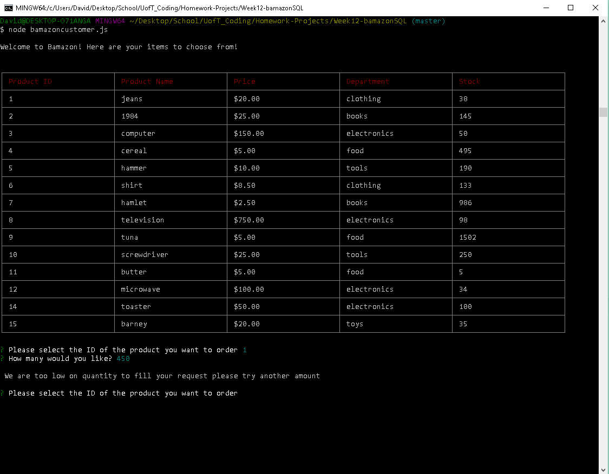
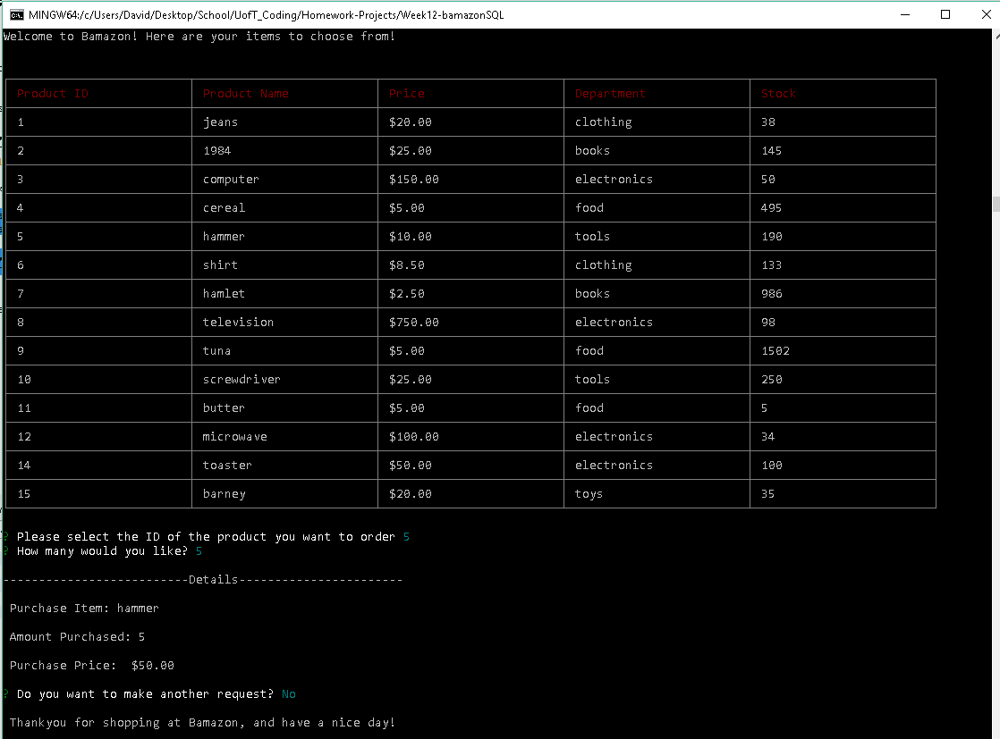
  


##### Level 2: Manager
***

In the manager level, the user can perform various duties to check the stock and change the inventory. Managerial functions include:
* View products for sale
* View low inventory
* Add to inventory
* Add a new product

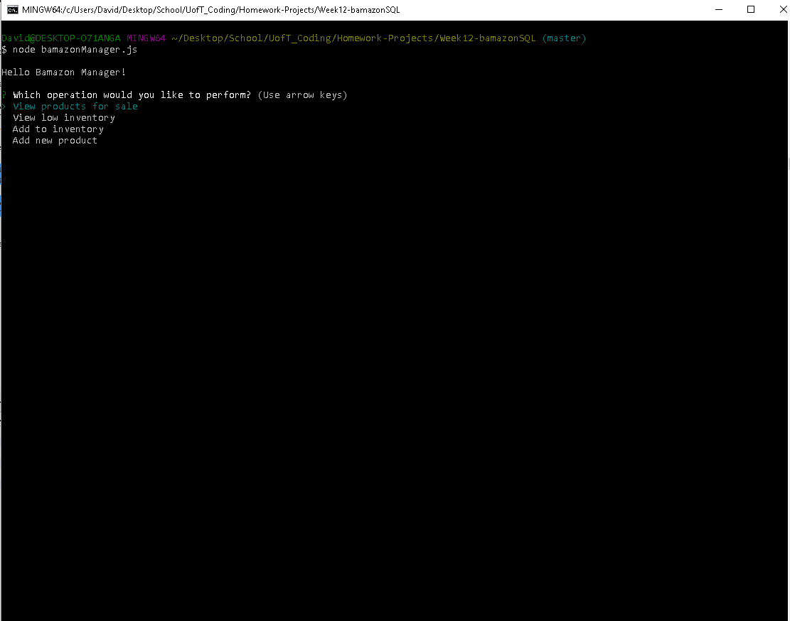

###### View products for sale
***

This allows the manager to view all the products currently for sale. It lists all categories from the table stored in the database. 

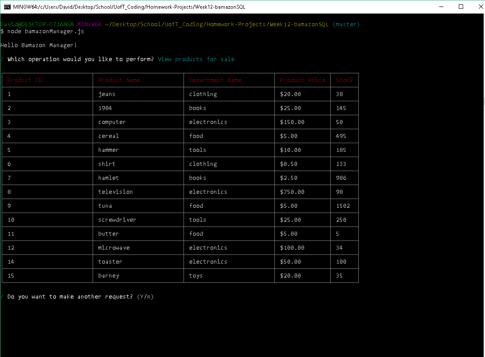

###### View low inventory
***

This allows the manager to view all products with low quantity. Because of the large quantities of my mock files, this displays any item with a quantity less than 50. 

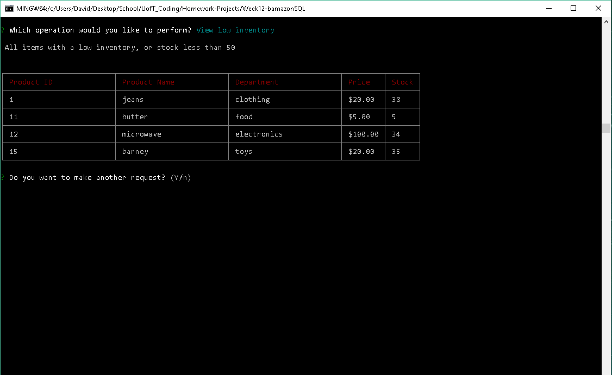

###### Add to Inventory
***

This allows the manager to add stock to an already existing product. A list of products is provided to prevent adding stock to a non - existent product. Upon success a message is displayed to the user informing them the addition has been made with the details of the update. 

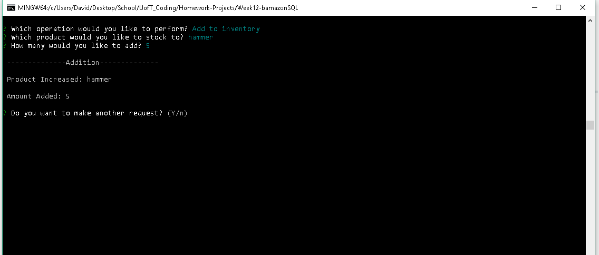

###### Add a new product
***

This allows the manager to add a brand new product. A list of existing departments is provided to prevent the manager from adding a product in a department that is not already in the database (only supervisors can add departments). Furthermore the user cannot add a product that already exists. Once the input passes these tests, the database is updated to reflect the change and the user recieves a message with the details of the new product being added. 

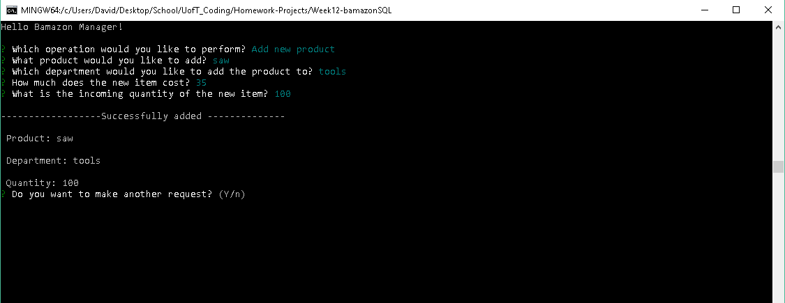


##### Level 3: Supervisor
***

This final app allows the user to perform all the duties of a supervisor. These duties include: 
* View product sales by department
* Create new department
* View Highest grossing department (Bonus)

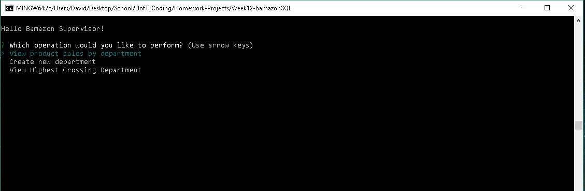

###### View sales by department
***

This option allows the user to view the total profit of each department. The product sales value is gathered from the total sales of each department in the products table. 'Total Profit' is dynamically calculated and not hard coded into the database

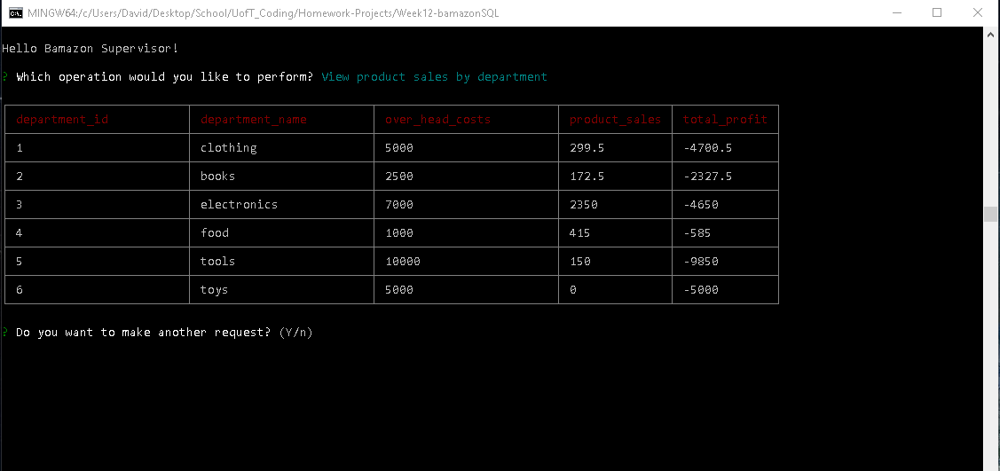

###### Create new department 
***

The supervisor can add a new department, and only has to include the name and over head costs. The supervisor is not allowed to enter a department that already exists. 

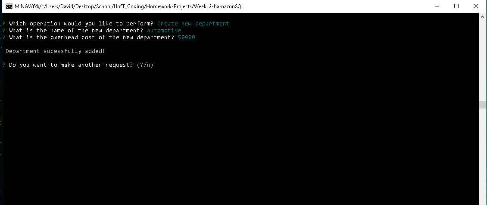

###### View Highest grossing department
***

This option presents the supervisor with a small table showing the department with the highest profit.

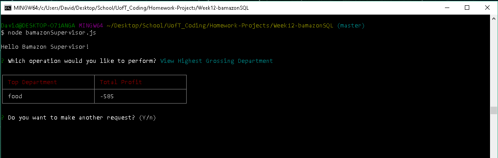 


